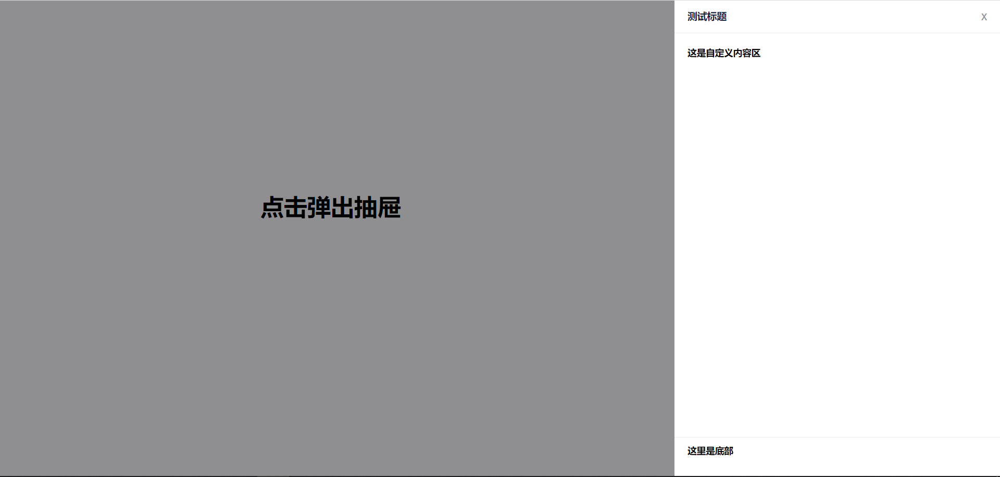

# vue-drawer

#### 介绍
vue组件：抽屉

#### 效果图


#### 全局注册

import drawer from './drawer/drawer.vue'  
Vue.component('drawer', drawer)

#### 使用说明
##### Attributes
|属性|说明|类型|可选值|默认值|
|:----    |:---|:-----|:----- |-----   |
|     visible.sync        |    是否显示Dialog，支持 .sync 修饰符   |      boolean     |             ——             |       false|
|     loading.sync        |    是否显示加载图标，支持 .sync 修饰符   |      boolean     |             ——             |       false|
|     loadingColor        |    加载图标颜色                       |      string     |             ——             |       #409EFF|
|      title              |           标题名称                |           string |                 ——          |            标题|
|      headerShow         |       标题头部是否显示                |       boolean    |               ——           |         true|
|   header-background     |       标题头部背景颜色                |       string     |               ——           |          #fff|
|     closeBtnShow        |        关闭按钮是否显示               |        boolean   |                 ——         |         true|
|     title-color         |        标题头部标题                 |         string   |                ——          |            #000|
|   main-background       |        内容背景颜色                 |         string   |                ——          |           #fff|
|   footerShow            |        底部是否显示                 |         boolean  |                 ——         |            false|
|   footer-height         |          底部高度                 |           string |                  ——        |              60px|
|   footer-background     |       底部背景颜色                  |         string   |                 ——         |             #fff|
|       width             |   侧栏宽度(align为right,left生效)  |           string |                  ——        |             500px|
|       height             |  侧栏高度(align为top,bottom生效)  |           string |                  ——        |             300px|
|       align             |         侧栏位置                  |          string  |    top,bottom,right,left   |            right|
|       modal             |       是否显示遮罩层                 |       boolean    |              ——            |         true|
|   close-on-click-modal  |     点击遮罩层是否关闭                 |       boolean    |              ——            |         false|

##### Events
|事件|说明|默认值|
|:---- |:---|-----   |
|   open     |  Dialog 打开的回调 | ——  |  
|   opened   |  Dialog 打开动画结束时的回调 | ——  |  
|   close    |  Dialog 关闭的回调 | ——   |  
|   closed   |  Dialog 关闭动画结束时的回调 | ——  |  
#### slot
|slot|说明|默认值|
|:---- |:---|-----   |
| header   |  头部操作区的内容| ——  |
| footer   |  底部操作区的内容| ——  | 

#### 例子 (简单）
````
<drawer
  title="测试"
  :visible.sync='dialogVisible'
  width="500px"
  close-on-click-modal
>
</drawer>
````
#### 例子（完整属性）
````
 <drawer
   :visible.sync='dialogVisible'
   :headerShow="true"
   header-background="#f5f5f5"
   title-color="#000"
   main-background="#EBEEF5"
   :footerShow="true"
   footer-height="60px"
   footer-background="#f5f5f5"
   width="500px"
   height="300px"
   align="right"
   :modal="true"
   close-on-click-modal
   :loading.sync="loading"
   loadingColor="#ff6700"
   @close="text"
   @closed="text"
   @open="text"
   @opend="text"
    >
     <div slot="header">
       <p>头部</p>
     </div>

   <!--内容区-->
   <div>
     <p>内容</p>
   </div>

   <!--这里是底部-->
   <div slot="footer">
     <p>底部</p>
   </div>
 </drawer>
````
#### 开发者 & 其他

* @title 原生vue抽屉组件
* @author 遗忘
* @time 2019-07-04
* @QQ 1786787613
* @other 欢迎提交bug，请写清楚遇到问题的原因，开发环境，复显步骤。

